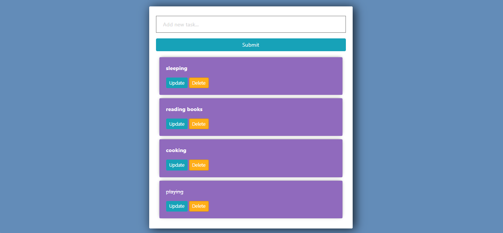
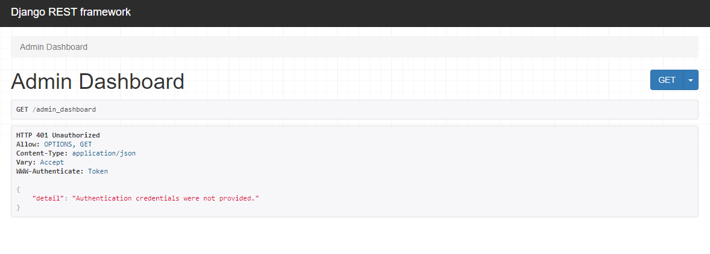
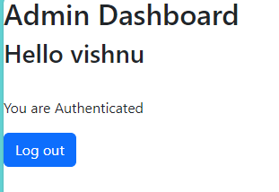

In this project we are enabling token authorization to our website 

1. We have three html page 
 -> register.html
 -> login.html
 -> admin_dashboard.html 

 2. URL will redirect to login page http://localhost:8000/ user can login if account created else register themselves by clicking on register button

 

3. If we try to access directly http://localhost:8000/admin_dashboard it will throw error as our api is ptotected with token authorization

4. After login successfully we can access admin_dashboard with user name printed in it.

